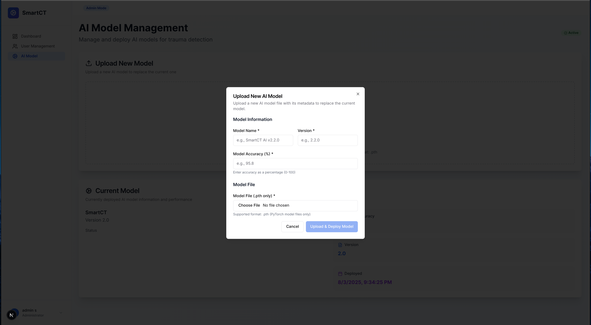

# SmartCT

# 🩻 Abdominal Trauma Detection from CT Scans

This project implements a deep learning pipeline and a full-stack web system for **automated detection of abdominal organ injuries** from 3D CT scans. It includes:

- A **3D multi-head neural network** (DenseNet121 backbone) for organ-specific injury classification.
- Preprocessing scripts to convert **DICOM → NIfTI**.
- Model training, evaluation, and inference pipelines.
- A **React + Express** web application for CT scan upload, AI inference, and results visualization.

---

## 📂 Dataset

We used the **[RSNA 2023 Abdominal Trauma Detection](https://www.kaggle.com/competitions/rsna-2023-abdominal-trauma-detection/)** dataset from Kaggle.  

- The dataset consists of **contrast-enhanced abdominal CT scans** in **DICOM format**.  
- Labels are provided for **five organs**:  

  - **Bowel Injury** → Binary (injury vs. no injury)  
  - **Extravasation (bleeding)** → Binary (present vs. absent)  
  - **Kidney Injury** → Multi-class (none, low, high)  
  - **Liver Injury** → Multi-class (none, low, high)  
  - **Spleen Injury** → Multi-class (none, low, high)  

### 🔄 Preprocessing

DICOM scans were converted into **NIfTI format** for efficient 3D model training:

- Script: `model/dicom-to-nifti-conversion.ipynb`  
- All metadata (patient IDs, study IDs, raw labels) stored in a **JSON file** for structured access.  

---

## 🧠 Model Architecture

- **Backbone**: 3D DenseNet121 (via MONAI)  
- **Heads**:  
  - Binary classifiers → bowel injury, extravasation  
  - Multi-class classifiers → kidney, liver, spleen  
- **Loss functions**:  
  - Binary: BCEWithLogitsLoss  
  - Multi-class: focal loss with label smoothing  
- **Optimizer**: AdamW  
- **Scheduler**: CosineAnnealingWarmRestarts 

---

## 📊 Training & Evaluation

Training this model was particularly challenging due to **severe class imbalance** in the RSNA dataset. Injuries such as bowel or high-grade organ injuries were **extremely underrepresented**, making it difficult for the model to generalize across all classes.  

### ⚖️ Imbalance Handling
- Applied a **two-step balancing strategy**:
  - Manually constructed a **balanced subset** across organs and injury severities.  
  - Used **WeightedRandomSampler** during training to oversample minority classes.  
- Employed **Focal Loss** (with label smoothing) to focus on hard-to-classify positive samples.  

### 📈 Metrics
- **Evaluation metrics**: Precision, Recall, F1-score, ROC-AUC (per organ), and confusion matrices for multi-class tasks.  

### 📊 Results
- **Bowel Injury & Extravasation (binary tasks)**  
  - Strong performance despite imbalance.  
  - **F1-score ≈ 0.55–0.63**  
  - **ROC-AUC ≈ 0.82–0.85**  

- **Kidney, Liver, and Spleen Injuries (multi-class tasks)**  
  - Much more challenging due to highly skewed distributions of “low” and “high” injury cases.  
  - **F1-score ≈ 0.30–0.37**  
  - **ROC-AUC ≈ 0.55–0.64**  

🔎 These results highlight that **binary injury detection (present vs. absent)** is feasible and performs well, while **multi-class severity classification remains difficult under heavy imbalance**.

---

## 🌐 Web Application

The project includes a **full-stack web system**:

- **Frontend**: React (upload UI, results visualization)  
- **Backend**: Node.js + MongoDB + Bull Queue  
  - Handles uploads, queues AI inference jobs, stores results  
- **Inference**: `inference.py` loads trained MONAI model, applies preprocessing/postprocessing, returns predictions  

Users can upload CT scans (`.nii`, `.nii.gz`, or zipped DICOMs) and view structured AI predictions.

---

## 🚀 Usage
### 1️⃣ Clone the repository
```bash
git clone https://github.com/S-anuu/SmartCT.git
cd SmartCT
```

### 2️⃣ Install dependencies

#### Backend (Node.js + Express + MongoDB + Bull Queue)
```bash
cd backend
npm install
cd ..
```

#### Frontend (React)
```bash
cd frontend
npm install
cd ..
```

#### Model Training (PyTorch + MONAI)
```bash
pip install -r requirements.txt
```

### 3️⃣ Prepare the data

#### Download dataset: RSNA 2023 Abdominal Trauma Detection

#### Convert DICOM → NIfTI
python model/dicom_to_nifti.py --input data/dicom --output data/nifti

### 4️⃣ Train the model (optional)
#### You can train from scratch OR skip this step and use the pretrained checkpoint.
Run the notebook - model/model-training.ipynb

### 5️⃣ Run inference on a single scan
Run the notebook - model/evaluation-code.ipynb

### 6️⃣ Start the web application

#### Start backend server
```bash
cd backend
npm run dev
cd ..
```

#### Start frontend
```bash
cd frontend
npm start
cd ..
```

#### 🔑 Note:
#### - If you don’t want to train the model, you can directly use the pretrained model:
####   Place your `checkpoint.pth` file in the designated backend/uploads/models/ directory OR
####   Upload it through the Admin → Change Model section in the web app.

## Screenshots
### Project Screenshots

Below are some screenshots of the project:





